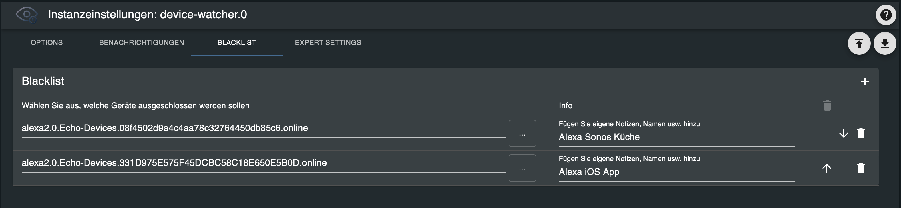

# ioBroker.device-watcher

## Blacklist

Es ist möglich Geräte anzugeben, die in der Aufzählung und Benachrichtigung ausgeschlossen werden sollen. Da der Adapter ein Hauptdatenpunkt je Adapter nutzt um die Information zu bekommen, ist es wichtig den richtigen Datenpunkt für die Blacklist zu wählen damit diese richtig funktioniert. 

| Adapter            | Datenpunkt                      |
|--------------------|---------------------------------|
| Alexa2             | alexa2.*.online                 |
| Ble                | ble.*.rssi                      |
| Deconz             | deconz.*.reachable              |
| Enocean            | enocean.*.rssi                  |
| ESP Home           | esphome.*._online               |
| FritzDect          | fritzdect.*.present             |
| Ham                | ham.*.Battery-Level             |
| Harmony            | harmony.*.hubConnected          |
| HMiP               | hmip.*.rssiDeviceValue          |
| HM-RPC (Homematic) | hm-rpc.*.UNREACH                |
| Hue                | hue.*.reachable                 |
| Hue Extended       | hue-extended.*.reachable        |
| Jeelink            | jeelink.*.lowBatt               |
| miHome             | mihome.*.percent                |
| miHome Gateways    | mihome.*.connected              |
| miHome Vacuum      | mihome-vacuum.*.wifi_signal     |
| Netatmo            | netatmo.*.LastUpdate            |
| Nuki Extended      | nuki-extended.*.batteryCritical |
| Ping               | ping.*.alive                    |
| Roomba             | roomba.0.states.signal          |
| Shelly             | shelly.*.rssi                   |
| Sonoff             | sonoff.*.Uptime                 |
| Sonos              | sonos.*.alive                   |
| Switchbot Ble      | switchbot-ble.*.rssi            |
| Tado               | tado.*.batteryState             |
| Tradfri            | tradfri.*.lastSeen              |
| WLED               | wled.*._online                  |
| Yeelight           | yeelight-2.*.connect            |
| Zigbee             | zigbee.*.link_quality           |
| Zwave              | zwave2.*.ready                  |
