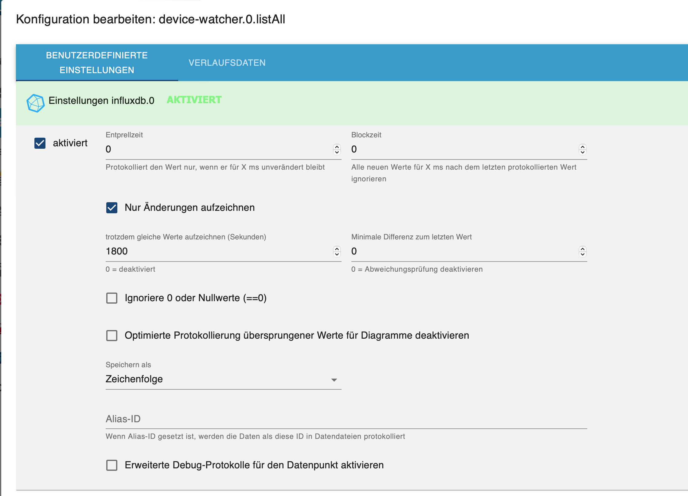
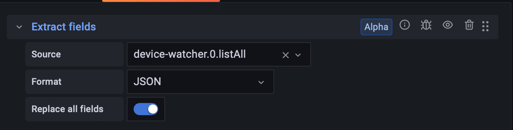
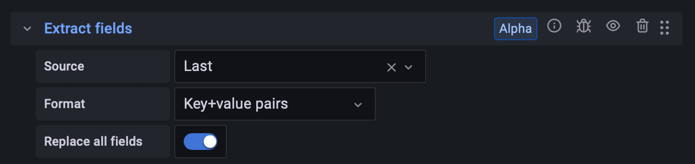

# ioBroker.device-watcher

## Wie JSON Tabelle in Grafana anzeigen

Um Json Listen in Grafana korrekt und ohne Plugin anzeigen lassen zu können, müssen gewisse Einstellungen vorgenommen werden. 

1. Als erstes gibt man die Werte der Datenpunkte weiter an die InfluxDB

2. In Grafana erstellt man dann ein neues Panel und wählt die Visualisierung `Table` aus.

3. In den Query Einstellungen wählt man als Data source `InfluxDB` aus. Bei `From` nimmt man sein gewünschten Datenpunkt, bei `Select` entfernt man das voreingestellte `mean()` und bei `Group by` müssen `time($_interval)` und `fill(null)` entfernt werden. (Draufklicken und auf remove)

4. Danach geht man auf den Reiter Transform.

5. Hier muss man nun drei Transformationen wählen:

- Als erstes nimmt man `Extract fields`. Wählt als Source den Datenpunkt aus, Format ist `JSON` und die Checkbox `Replace all fields` wird ausgewählt.

- Die nächste Transformation ist `Reduce`. Hier muss man angeben das nur der letzte aufgezeichnete Wert vom Datenpunkt angezeigt werden soll. Daher nimmt man als Mode `Series to rows` und bei Calculations wird `Last` gewählt.

- Zu guter letzt fügt man die Transformation `Extract fields` noch mal hinzu. Wählt als Source den `Last` Wert aus, diesmal nimmt man das Format `Key+value pairs` und wählt wieder die Checkbox `Replace all fields` aus. 

Wenn alle Einstellungen getroffen wurden, sollte die Tabelle korrekt angezeigt werden.

