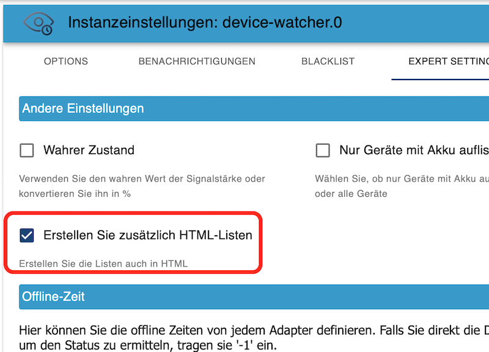

# ioBroker.device-watcher

## HTML Tabelle in Lovelace-UI anzeigen


- Aktiviere zuerst in den Instanz Einstellungen vom Adapter Device-Watcher das die HTML Tabellen mit erzeugt werden sollen.




- Danach können die Tabellen in Lovelace hinzugefügt werden. Die Karten sind vom Typ `Markdown`. Hier ist ein Beispiel Code der Intergration, es müsste nur noch der Pfad der Listen angepasst werden:

```
type: markdown
content: |-
  {device-watcher.0.offlineListHTML}
  <small><font color=gray>DataTime: {device-watcher.0.lastCheck}</font></small>
```