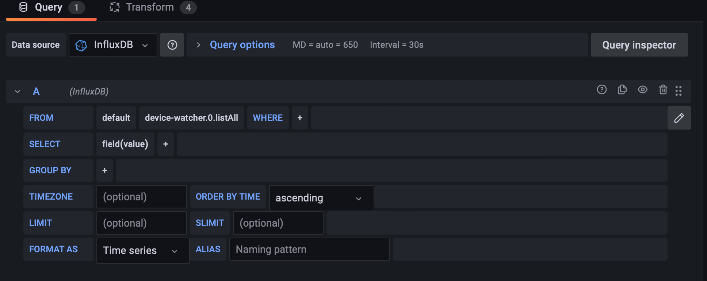
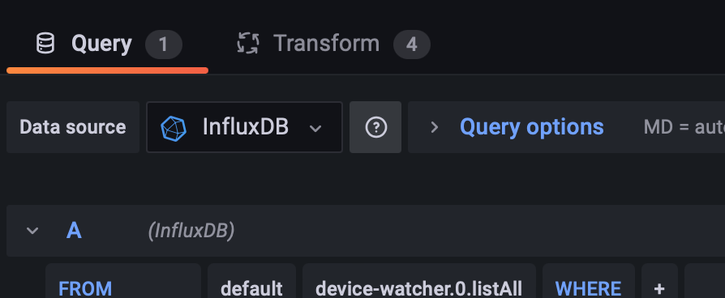
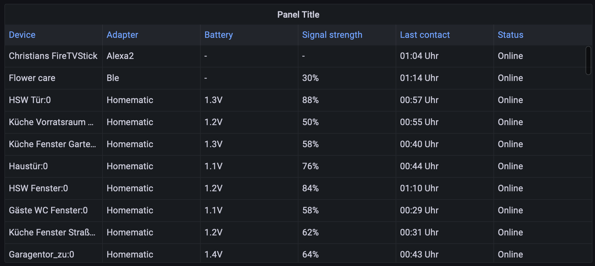

# ioBroker.device-watcher

## How to show JSON lists in Grafana

In order to display json lists correctly in Grafana without a plugin, certain settings have to be made. 

1. First, you pass the values of the data points to InfluxDB.

2. In Grafana create a new panel and select the visualization `Table`.

3. In the query settings select `InfluxDB` as data source. At `From` take your desired data point, at `Select` remove the default `mean()` and at `Group by` you have to remove `time($_interval)` and `fill(null)`. (click on it and then on remove)

4. After that click on the `Transform` tab.

5. Here you have to choose three transformations:

- The first step is to use `Extract fields`. Select the data point as source, format is `JSON` and the checkbox `Replace all fields` is selected.

- The next transformation is `Reduce`. Here you must specify that only the last recorded value of the data point is to be displayed. Therefore one takes as mode `Series to rows` and at Calculations `Last` is selected.

- Finally, add the transformation `Extract fields` again. Select the `Last` value as source, this time use the format `Key+value pairs` and select the checkbox `Replace all fields` again. 

When all settings are made, the table should be displayed correctly.

