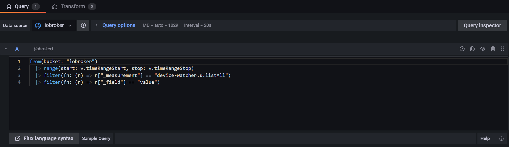
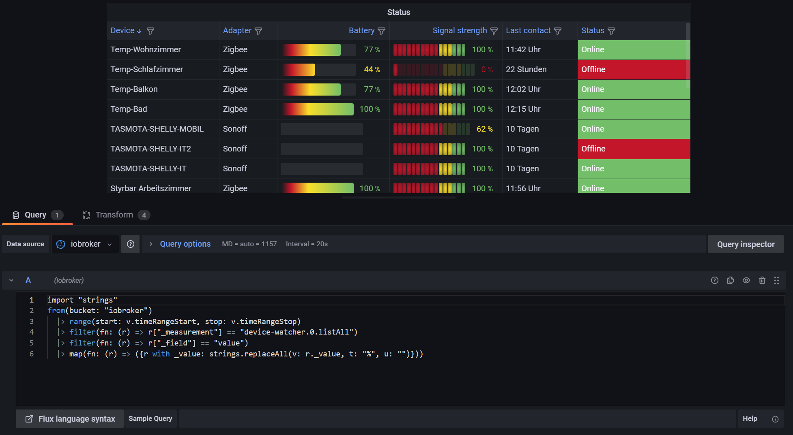

# ioBroker.device-watcher

## How to show JSON lists in Grafana with Flux

In order to display json lists correctly in Grafana without a plugin, certain settings have to be made. 

1. First, you pass the values of the data points to InfluxDB.


2. In Grafana create a new panel and select the visualization `Table`.


3. In the query settings select your ioBroker database as data source. Then enter the following syntax (the bucket name and data point name in the measurement area may be different for you, so please check and adjust if necessary):
```
from(bucket: "iobroker")
    |> range(start: v.timeRangeStart, stop: v.timeRangeStop)
    |> filter(fn: (r) => r["_measurement"] == "device-watcher.0.listAll")
    |> filter(fn: (r) => r["_field"] == "value")
```



4. After that click on the `Transform` tab.


5. Here you have to choose three transformations:

- The first step is to use `Extract fields`. Select the data point as source, format is `JSON` and the checkbox `Replace all fields` is selected.


- The next transformation is `Reduce`. Here you must specify that only the last recorded value of the data point is to be displayed. Therefore one takes as mode `Series to rows` and at Calculations `Last` is selected.


- Finally, add the transformation `Extract fields` again. Select the `Last` value as source, this time use the format `Key+value pairs` and select the checkbox `Replace all fields` again. 


When all settings are made, the table should be displayed correctly.


### Additional information:

If you want to display the battery and signal graphically as gauges, you have to change the syntax like in the following example and remove the percent signs to change the text from type string to number:
```
import "strings"
from(bucket: "iobroker")
  |> range(start: v.timeRangeStart, stop: v.timeRangeStop)
  |> filter(fn: (r) => r["_measurement"] == "Device-Status")
  |> filter(fn: (r) => r["_field"] == "value")
  |> map(fn: (r) => ({r with _value: strings.replaceAll(v: r._value, t: "%", u: "")}))
```

After that, you can customize the displays according to your wishes, as shown in the picture

