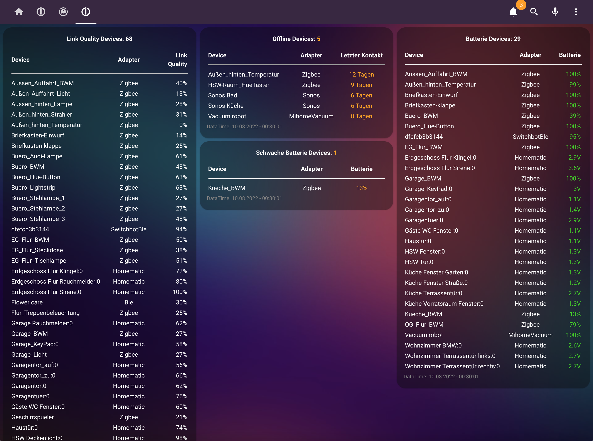
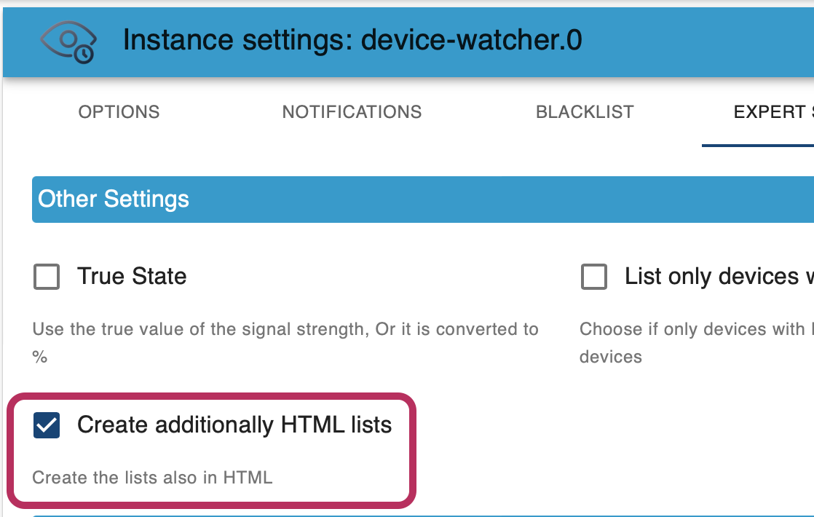

# ioBroker.device-watcher

## Show HTML table in Lovelace-UI



- First activate in the instance settings of the Adapter Device-Watcher that the HTML tables should be created.




- After that, the tables can be added in Lovelace. The maps are of type `markdown`. Here is a sample code of the integration, only the path of the lists have to be adjusted:

```
type: markdown
content: |-
  {device-watcher.0.offlineListHTML}
  <small><font color=gray>DataTime: {device-watcher.0.lastCheck}</font></small>
```